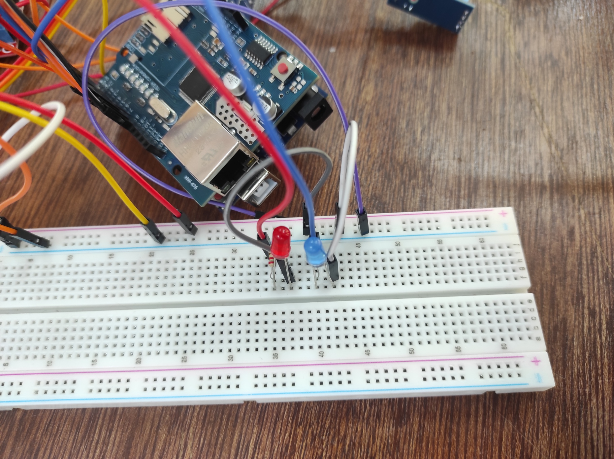
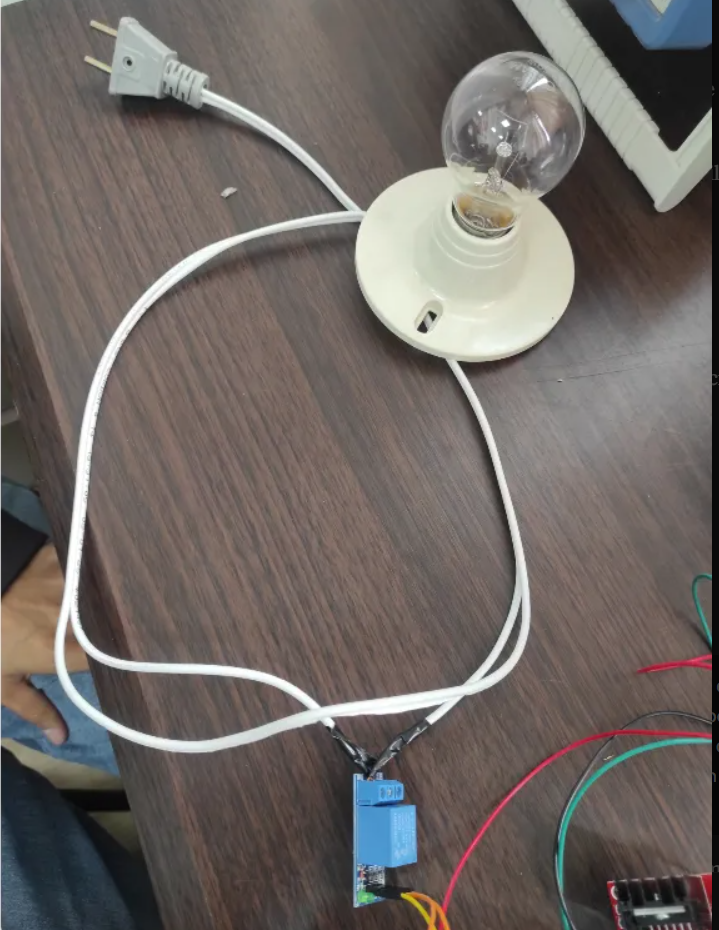
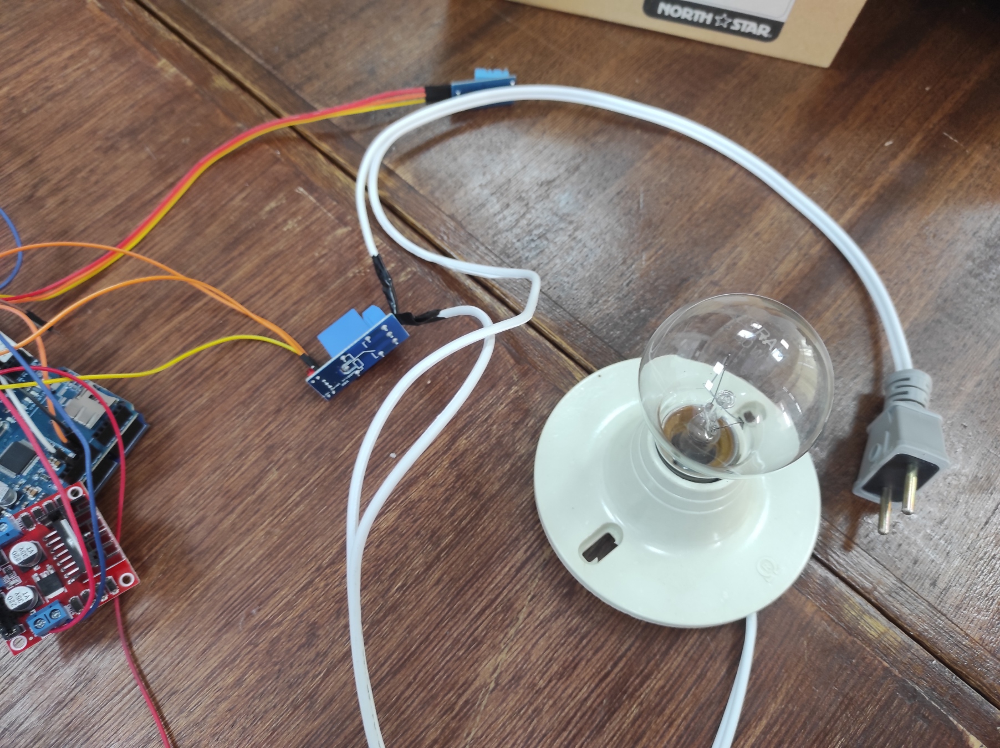
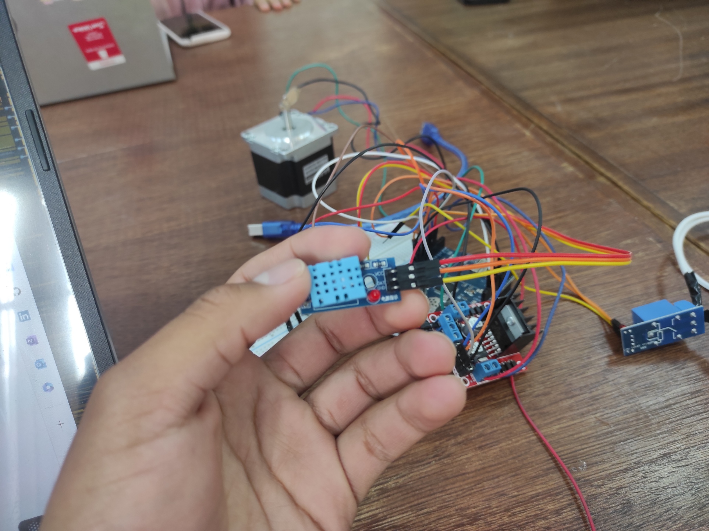
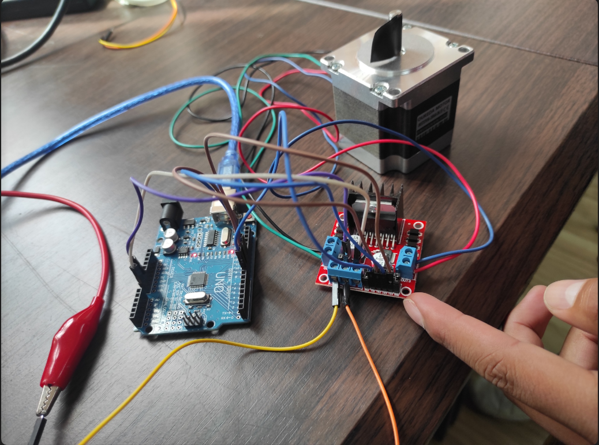
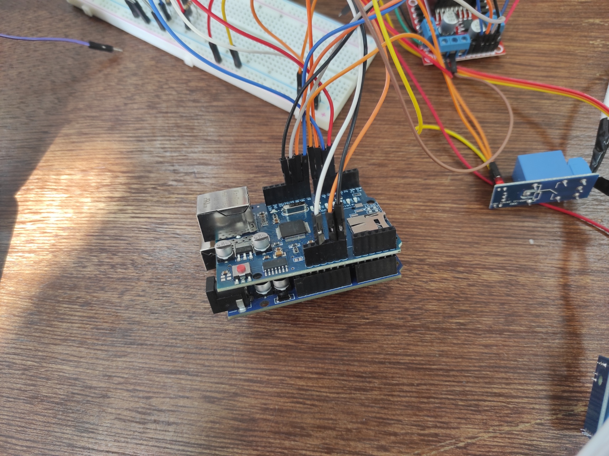

# Proyecto Arduino con Interfaz Web - Control de LEDs, Sensor DHT11, Motor Paso a Paso y Foco con Relay

## Descripción General

Esta práctica esta basada en IoT (Internet de las Cosas) que integra múltiples componentes controlados a través de una interfaz web. La placa Arduino UNO actúa como servidor web, utilizando un módulo Ethernet (como el ENC28J60) para permitir el control remoto desde un navegador. Los usuarios pueden interactuar con el sistema para:
- Encender y apagar LEDs (rojo y azul) para indicación visual.
- Activar/desactivar un foco de 60W mediante un módulo relay.
- Leer valores de temperatura y humedad ambiente con un sensor DHT11.
- Controlar un motor paso a paso Nema 23 ingresando ángulos específicos.

### Características Principales
- **Plataforma**: Arduino UNO con módulo Ethernet ENC28J60 (o similar).
- **Interfaz**: Servidor web accesible mediante una IP local (por ejemplo, `192.168.1.200`).
- **Componentes Controlados**: LEDs, sensor DHT11, motor paso a paso, relay y foco.
- **Fecha de Desarrollo**: Mayo 2025.
- **Objetivo**: Demostrar el uso de Arduino en aplicaciones IoT con control remoto y monitoreo en tiempo real.

## Tabla de Contenidos

- [Componentes Utilizados](#componentes-utilizados)
- [Conexiones del Circuito](#conexiones-del-circuito)
- [Configuración y Código](#configuración-y-código)
- [Funcionamiento Detallado](#funcionamiento-detallado)
- [Instrucciones de Uso](#instrucciones-de-uso)
- [Pruebas y Resultados](#pruebas-y-resultados)
- [Problemas Comunes y Soluciones](#problemas-comunes-y-soluciones)
- [Recomendaciones para Mejoras](#recomendaciones-para-mejoras)
- [Recursos Adicionales](#recursos-adicionales)
- [Contribuciones](#contribuciones)
- [Licencia](#licencia)
- [Notas para Desarrolladores](#notas-para-desarrolladores)

## Componentes Utilizados

### 1. LEDs (Rojo y Azul)
- **Tipo**: LEDs estándar de 5 mm.
- **Función**: Indicadores visuales para estados ON/OFF, controlados desde la interfaz web.
- **Especificaciones**:
    - LED Rojo: Conectado al pin digital 4 del Arduino.
    - LED Azul: Conectado al pin digital 5 del Arduino.
- **Resistencia**: 220 ohmios en serie para limitar la corriente y proteger los LEDs.
- **Espacio para Captura**:  
    
  *(Sube una imagen de la conexión de los LEDs aquí)*.

### 2. Foco de 60 Watts
- **Tipo**: Bombilla estándar de 60W, 220V AC.
- **Función**: Iluminación controlada remotamente mediante un módulo relay que actúa como interruptor.
- **Voltaje de Operación**: 220V AC (corriente alterna doméstica).
- **Conexión**: No se conecta directamente al Arduino; se controla a través del módulo relay.
- **Espacio para Captura**:  
    
  *(Sube una imagen de la conexión del foco y relay aquí)*.

### 3. Módulo Relay 5V-220V (1 Canal)
- **Tipo**: Módulo relay de un canal.
- **Función**: Permite al Arduino (5V) controlar dispositivos de alta tensión (220V AC) como el foco, proporcionando aislamiento eléctrico entre los circuitos de control y potencia.
- **Conexiones**:
    - VCC → 5V del Arduino.
    - GND → GND del Arduino.
    - IN → Pin digital 7 del Arduino.
- **Espacio para Captura**:  
    
  *(Sube una imagen de la conexión del relay aquí)*.

### 4. Sensor de Temperatura y Humedad DHT11
- **Tipo**: Sensor digital DHT11.
- **Función**: Mide temperatura y humedad ambiente, mostrando los valores en la interfaz web.
- **Rango de Medición**:
    - Temperatura: 0 a 50°C.
    - Humedad: 20% a 90% RH.
- **Precisión**:
    - Temperatura: ±2°C.
    - Humedad: ±5% RH.
- **Pin de Señal**: Conectado al pin digital 6 del Arduino.
- **Espacio para Captura**:  
    
  *(Sube una imagen de la conexión del sensor DHT11 aquí)*.

### 5. Motor Paso a Paso Nema 23
- **Tipo**: Motor bipolar Nema 23 Oukeda OK57STH56-2804A-D6-35.
- **Especificaciones**:
    - Pasos por Revolución: 200 (1.8° por paso).
    - Control: Usando módulo L298N y pines digitales 8-11 del Arduino.
- **Fuente de Alimentación**: 12V mediante BK Precision BK1550.
- **Espacio para Captura**:  
    
  *(Sube una imagen de la conexión del motor y L298N aquí)*.

### 6. Arduino UNO y Módulo Ethernet
- **Función**: Microcontrolador principal y servidor web para la interfaz remota.
- **Módulo Ethernet**: ENC28J60 (o similar), conectado vía SPI (pines 10-13 típicamente).
- **Especificaciones**:
    - Comunicación: Utiliza la librería `<Ethernet.h>` para manejar conexiones de red.
    - IP Estática: Ejemplo, `192.168.1.200` (configurable según la red).
- **Espacio para Captura**:  
    
  *(Sube una imagen del setup completo con Arduino y Ethernet aquí)*.

## Conexiones del Circuito

### Esquema General
- **LEDs**:
    - LED Rojo: Ánodo al pin 4, cátodo a GND a través de una resistencia de 220Ω.
    - LED Azul: Ánodo al pin 5, cátodo a GND a través de una resistencia de 220Ω.
- **Sensor DHT11**:
    - Pin de señal: Pin 6 del Arduino.
    - VCC: 5V del Arduino.
    - GND: Tierra del Arduino.
- **Relay**:
    - VCC → 5V del Arduino.
    - GND → GND del Arduino.
    - IN → Pin 7 del Arduino.
    - Conexión del Foco:
        - Fase (220V AC) → Terminal COM del relay.
        - Terminal NO (Normalmente Abierto) → Un extremo del foco.
        - Neutro (220V AC) → Otro extremo del foco.
- **Motor Paso a Paso**:
    - **Bobinas**:
        - Bobina A (rojo/azul) → OUT A (1A/2A) del L298N.
        - Bobina B (negro/verde) → OUT B (3A/4A) del L298N.
    - **Pines de Control**:
        - IN1 → Pin 8.
        - IN2 → Pin 9.
        - IN3 → Pin 10.
        - IN4 → Pin 11.
    - **Alimentación del L298N**:
        - 12V y GND desde la fuente BK Precision BK1550.
        - Jumper "5V Regulator Enable" retirado, pin 5V del L298N conectado a 5V del Arduino.
- **Módulo Ethernet**:
    - Conectado a los pines SPI del Arduino (10-13, dependiendo del módulo).
    - Alimentación: 3.3V o 5V (según el módulo), GND conectado a tierra.

**Nota Importante**: Asegúrate de unificar todas las tierras (GND) del circuito para evitar problemas de referencia de voltaje. Usa cables de buena calidad para minimizar ruido eléctrico.

## Configuración y Código

### Requisitos de Software
- **IDE de Arduino**: Versión 2.x o superior.
- **Librerías Necesarias**:
    - `<Ethernet.h>`: Para manejar la comunicación con el módulo Ethernet.
    - `<Stepper.h>`: Para controlar el motor paso a paso.
    - `<DHT.h>`: Para leer datos del sensor DHT11.
- **Instalación de Librerías**:
    1. Abre el IDE de Arduino.
    2. Ve a `Sketch > Include Library > Manage Libraries`.
    3. Busca e instala `Ethernet`, `Stepper` y `DHT sensor library` (por Adafruit).

### Código Principal
El código completo está disponible en el directorio `src/` del repositorio (o súbelo si no lo has hecho). A continuación, se detallan las secciones clave:

#### 1. Definición de Pines y Variables
```cpp
#include <Ethernet.h>
#include <Stepper.h>
#include <DHT.h>

// Pines
#define LED_ROJO 4
#define LED_AZUL 5
#define DHT_PIN 6
#define RELAY_PIN 7
#define IN1 8
#define IN2 9
#define IN3 10
#define IN4 11

// Configuración del Motor
const int pasosPorRevolucion = 200;
const int velocidadMotor = 100;
Stepper motor(pasosPorRevolucion, IN1, IN2, IN3, IN4);

// Configuración del DHT11
#define DHT_TYPE DHT11
DHT dht(DHT_PIN, DHT_TYPE);

// Configuración de Ethernet
byte mac[] = { 0xDE, 0xAD, 0xBE, 0xEF, 0xFE, 0xED };
IPAddress ip(192, 168, 1, 177); // Ajusta según tu red
EthernetServer server(80);
```

### 2. Configuración Inicial (setup())

```cpp
void setup() {
  // Configurar pines
  pinMode(LED_ROJO, OUTPUT);
  pinMode(LED_AZUL, OUTPUT);
  pinMode(RELAY_PIN, OUTPUT);
  digitalWrite(LED_ROJO, LOW);
  digitalWrite(LED_AZUL, LOW);
  digitalWrite(RELAY_PIN, LOW);

  // Iniciar comunicación serial
  Serial.begin(9600);

  // Iniciar Ethernet
  Ethernet.begin(mac, ip);
  server.begin();
  Serial.print("Servidor iniciado en: ");
  Serial.println(Ethernet.localIP());

  // Iniciar DHT11
  dht.begin();

  // Configurar motor
  motor.setSpeed(velocidadMotor);
}
```

### 3. Manejo de Peticiones HTTP (loop())
```cpp
void loop() {
  EthernetClient client = server.available();
  if (client) {
    String peticion = "";
    while (client.connected()) {
      if (client.available()) {
        char c = client.read();
        peticion += c;
        if (c == '\n') {
          // Procesar la petición
          if (peticion.indexOf(F("GET /ROJO_ON")) >= 0) {
            digitalWrite(LED_ROJO, HIGH);
          } else if (peticion.indexOf(F("GET /ROJO_OFF")) >= 0) {
            digitalWrite(LED_ROJO, LOW);
          } else if (peticion.indexOf(F("GET /AZUL_ON")) >= 0) {
            digitalWrite(LED_AZUL, HIGH);
          } else if (peticion.indexOf(F("GET /AZUL_OFF")) >= 0) {
            digitalWrite(LED_AZUL, LOW);
          } else if (peticion.indexOf(F("GET /RELAY_ON")) >= 0) {
            digitalWrite(RELAY_PIN, HIGH);
          } else if (peticion.indexOf(F("GET /RELAY_OFF")) >= 0) {
            digitalWrite(RELAY_PIN, LOW);
          } else if (peticion.indexOf(F("GET /GIRAR_MOTOR?angulo=")) >= 0) {
            int inicioIndex = peticion.indexOf(F("GET /GIRAR_MOTOR?angulo=")) + 24;
            int finIndex = peticion.indexOf(F(" "), inicioIndex);
            String valorAngulo = peticion.substring(inicioIndex, finIndex);
            int ultimoAngulo = valorAngulo.toInt();
            int pasos = map(ultimoAngulo, 0, 360, 0, pasosPorRevolucion);
            motor.step(pasos);
            Serial.print(F("Motor movido "));
            Serial.print(ultimoAngulo);
            Serial.println(F(" grados."));
          }

          // Enviar respuesta HTML
          enviarPaginaWeb(client);
          break;
        }
      }
    }
    client.stop();
  }
}
```

### 4. Interfaz Web (enviarPaginaWeb())
```cpp
void enviarPaginaWeb(EthernetClient client) {
  client.println(F("HTTP/1.1 200 OK"));
  client.println(F("Content-Type: text/html"));
  client.println(F("Connection: close"));
  client.println();

  // HTML
  client.println(F("<!DOCTYPE HTML>"));
  client.println(F("<html>"));
  client.println(F("<head><title>Control IoT Arduino</title></head>"));
  client.println(F("<body>"));
  client.println(F("<h1>Control de Dispositivos</h1>"));

  // Control de LEDs
  client.println(F("<h2>LEDs</h2>"));
  client.println(F("<a href='/ROJO_ON'><button>LED Rojo ON</button></a>"));
  client.println(F("<a href='/ROJO_OFF'><button>LED Rojo OFF</button></a><br>"));
  client.println(F("<a href='/AZUL_ON'><button>LED Azul ON</button></a>"));
  client.println(F("<a href='/AZUL_OFF'><button>LED Azul OFF</button></a><br>"));

  // Control del Relay
  client.println(F("<h2>Foco</h2>"));
  client.println(F("<a href='/RELAY_ON'><button>Foco ON</button></a>"));
  client.println(F("<a href='/RELAY_OFF'><button>Foco OFF</button></a><br>"));

  // Control del Motor
  client.println(F("<h2>Motor Paso a Paso</h2>"));
  client.println(F("<form action='/GIRAR_MOTOR' method='get'>"));
  client.println(F("<label for='angulo'>Ángulo (-360 a 360):</label>"));
  client.println(F("<input type='number' id='angulo' name='angulo' min='-360' max='360' value='0'>"));
  client.println(F("<input type='submit' value='Girar'>"));
  client.println(F("</form>"));

  // Mostrar datos del DHT11
  float temperatura = dht.readTemperature();
  float humedad = dht.readHumidity();
  client.println(F("<h2>Datos del Sensor DHT11</h2>"));
  client.print(F("Temperatura: "));
  client.print(temperatura);
  client.println(F(" °C<br>"));
  client.print(F("Humedad: "));
  client.print(humedad);
  client.println(F(" %<br>"));

  client.println(F("</body>"));
  client.println(F("</html>"));
}
```


### Funcionamiento Detallado
### Flujo de Trabajo

1. Inicialización:
   - El Arduino configura los pines de salida para LEDs y relay, inicializa el sensor DHT11 y establece la velocidad del motor.
   - Se inicia la comunicación Ethernet con una IP estática y un servidor en el puerto 80.
2. Escucha de Peticiones:
   - El servidor escucha constantemente peticiones HTTP entrantes.
   - Cuando un cliente (navegador) se conecta, el Arduino lee la solicitud (por ejemplo, /ROJO_ON).
3. Procesamiento de la Petición:
   Según la URL recibida:
    - /ROJO_ON o /ROJO_OFF: Cambia el estado del pin 4 (LED rojo).
    - /AZUL_ON o /AZUL_OFF: Cambia el estado del pin 5 (LED azul).
    - /RELAY_ON o /RELAY_OFF: Cambia el estado del pin 7 (relay/foco).
    - /GIRAR_MOTOR?angulo=X: Extrae el ángulo, lo convierte a pasos y mueve el motor.
4. Respuesta al Cliente:
   - El Arduino envía una página HTML actualizada con el estado de los dispositivos y los datos del DHT11.
   - La página incluye botones y un formulario para interactuar con el sistema.
5. Ciclo Continuo:
   - El Arduino sigue escuchando nuevas peticiones mientras está encendido.


#### Funcionamiento de Componentes Específicos

1. LEDs:
   - Los LEDs se encienden (HIGH, 5V) o apagan (LOW, 0V) según las señales enviadas a los pines 4 y 5.
2. Relay y Foco:
   - Al enviar HIGH al pin 7, el relay cierra el contacto (NO-COM), permitiendo el flujo de corriente al foco (220V AC).
   - Al enviar LOW, el relay abre el contacto, apagando el foco.
3. Sensor DHT11:
   - Lee temperatura y humedad cada vez que se genera la página web.
   - Los valores se envían al cliente como parte del HTML.
4. Motor Paso a Paso:
   - El motor recibe pulsos eléctricos en una secuencia específica para mover el rotor en pasos discretos (1.8° por paso).
   - El ángulo ingresado se convierte a pasos con map(), aunque esta función tiene limitaciones con ángulos negativos (ver problemas).


## Instrucciones de Uso
1. Configuración del Hardware
   
   Conexiones:
      - Conecta todos los componentes según el esquema de conexiones descrito anteriormente.
      - Verifica que las tierras (GND) estén unificadas para evitar problemas eléctricos.
   
   Red:
      - Conecta el módulo Ethernet a tu red local mediante un cable RJ45.
      - Asegúrate de que el módulo tenga una IP válida y no entre en conflicto con otros dispositivos en la red.
   
   Alimentación:
      - Usa una fuente de 12V para el motor y L298N.
      - El Arduino puede alimentarse vía USB o con una fuente de 7-12V.

   2. Carga del Código
      Descarga:
         - Descarga el código desde el directorio src/ del repositorio (o súbelo si aún no está disponible).
   
      Ajustes:
         - Abre el archivo .ino en el IDE de Arduino.
         - Ajusta la dirección MAC y la IP estática según tu red
      ```cpp
         byte mac[] = { 0xDE, 0xAD, 0xBE, 0xEF, 0xFE, 0xED };
         IPAddress ip(192, 168, 1, 177); 
      ```
      Carga:
        - Conecta el Arduino a tu computadora vía USB.
        - Selecciona la placa (Arduino UNO) y el puerto correcto en el IDE.
        - Carga el código con el botón "Upload".
   
   
   ### 3. Acceso a la Interfaz Web:

Conexión:
  - Abre un navegador web en un dispositivo conectado a la misma red.
  - Ingresa la IP asignada al Arduino (por ejemplo, http://192.168.1.200).
      
Interacción:
  - Usa los botones para encender/apagar LEDs y el foco.
  - Ingresa un ángulo en el formulario para mover el motor (por ejemplo, 90 para 90°).
  - Observa los valores de temperatura y humedad actualizados en la página.

4. Monitoreo y Depuración
   
  - Monitor Serial:
     - Abre el Monitor Serial en el IDE de Arduino (9600 baudios).
     - Revisa mensajes de depuración, como confirmaciones de movimientos del motor o errores de conexión.
 
  - Red:
     - Si no puedes acceder a la IP, verifica la conexión del módulo Ethernet y la configuración de la red.


## Pruebas y Resultados
### Pruebas Realizadas
1. **LEDs**:
   - Encendido y apagado de LEDs rojo y azul desde la interfaz web.
   - Resultado: Funcionan correctamente, con respuesta inmediata a las peticiones /ROJO_ON, /ROJO_OFF, etc.

2. **Sensor DHT11**:
   - Lectura de temperatura y humedad en un ambiente controlado.
   - Resultado: Muestra valores aproximados (ej. 25°C, 60% RH) con márgenes de error esperados (±2°C, ±5% RH). Los datos se actualizan al refrescar la página.

3. **Relay y Foco**:
   - Activación/desactivación del foco mediante las rutas /RELAY_ON y /RELAY_OFF.
   - Resultado: El foco se enciende y apaga correctamente. No se observaron problemas de aislamiento eléctrico.

4. **Motor Paso a Paso**:
   - Pruebas con ángulos positivos:
        - 90°: 50 pasos (90 / 1.8 = 50), equivalente a un cuarto de vuelta..
        - 180°: 100 pasos, media vuelta.
        - 360°: 200 pasos, una vuelta completa.
   - Pruebas con ángulos negativos:
        - -90°: 50 pasos en sentido contrario.
        - -180°: 100 pasos en sentido contrario.
        - -360°: 200 pasos en sentido contrario.
   - Observación: Se notaron pequeñas vibraciones a 100 RPM, posiblemente debido a la velocidad alta.


### Problemas Comunes y Soluciones
1. **Sobrecalentamiento del L298N**

   - Problema: El L298N se calienta excesivamente al usar una fuente de 12V durante períodos prolongados.
   - Solución:
      - Limitar el uso continuo del motor a sesiones cortas durante las pruebas.
      - Añadir un disipador de calor al L298N para mejorar la disipación térmica.
      - Considerar una fuente de menor voltaje (ej. 9V) si el motor lo permite.
2. Flickering del Motor Paso a Paso
   - Problema: El motor no giraba, sino que parpadeaba o vibraba al inicio.
   - Solución:
      - Revisar las conexiones de las bobinas con un multímetro para identificar los pares correctos.
      - Intercambiar los cables de una bobina (ej. rojo y azul en OUT A) para corregir la secuencia de fases.
3. Memoria Excedida en el Arduino
   - Problema: Error de compilación: "data section exceeds available space in board" (RAM excedida, >2048 bytes).
   - Solución:
      - Reducir el uso de variables String y reemplazarlas por tipos más pequeños (como byte o char).
      - Usar PROGMEM para almacenar cadenas estáticas (como el HTML) en la memoria flash.
      - Simplificar el HTML enviado al cliente si es necesario.
4. Ángulos Negativos en el Motor
   - Problema: La función map(angulo, 0, 360, 0, pasosPorRevolucion) no maneja correctamente ángulos negativos, causando movimientos incorrectos.
   - Solución:
      - Usar un cálculo directo: pasos = (angulo * pasosPorRevolucion) / 360.
      - Determinar la dirección con una condición: motor.step(angulo < 0 ? -pasos : pasos).
5. Problemas de Conexión Ethernet
   - Problema: No se puede acceder a la IP del servidor desde el navegador.
   - Solución:
      - Verificar que el módulo Ethernet esté correctamente conectado y alimentado.
      - Asegurarse de que la IP configurada no esté en uso por otro dispositivo.
      - Revisar el Monitor Serial para confirmar que el servidor se ha iniciado correctamente.
   
### **Recomendaciones para Mejoras**
1. **Manejo de Ángulos Negativos**
   - Implementar una solución más robusta para el control del motor:
   ```cpp
      int pasos = (angulo * pasosPorRevolucion) / 360;
      motor.step(angulo < 0 ? -pasos : pasos);
    ```
   - Esto asegura que el motor gire en la dirección correcta para ángulos positivos y negativos.
2. Estabilidad del Motor
   - Reducir Vibraciones:
       - Disminuir la velocidad a 60 RPM (motor.setSpeed(60)) para minimizar vibraciones y pérdida de pasos.
   - Movimientos Suaves:
       - Usar la librería AccelStepper para implementar aceleración y deceleración, mejorando la estabilidad del motor.
       - Ejemplo: AccelStepper Documentation.
3. Seguridad del Relay
      - Añadir un fusible en la línea de 220V AC para proteger el circuito ante cortocircuitos o sobrecargas.
      - Usar un optoacoplador adicional para mayor aislamiento entre el Arduino y el relay.
4. Escalabilidad del Sistema
      - Más RAM y Pines: Migrar a un Arduino Mega (2560) para mayor capacidad de memoria y más pines disponibles.
      - Más Componentes: Añadir más sensores o actuadores (por ejemplo, un sensor de luz para controlar el foco automáticamente).
5. Mejoras en la Interfaz Web
   - Diseño Responsivo:
       - Agregar CSS para mejorar la apariencia de la página web.
       - Ejemplo: Usar frameworks como Bootstrap (Bootstrap CDN).
   - Gráficos Dinámicos:
      - Incluir JavaScript para mostrar gráficos de temperatura y humedad en tiempo real (por ejemplo, con Chart.js: Chart.js).
   - Actualización Automática:
      - Implementar AJAX para actualizar los datos del DHT11 sin recargar la página.
6. Monitoreo Avanzado
   - Agregar un sistema de registro (logging) para almacenar datos del DHT11 en una tarjeta SD o enviarlos a un servidor remoto.
   - Ejemplo: Usar la librería SD para almacenamiento local.
   

### **Recursos Adicionales**
   - Librería Ethernet: Arduino Ethernet Library
   - Librería Stepper: Arduino Stepper Library
   - Librería DHT: Adafruit DHT Library
   - Tutorial de Relay: Control de Relay con Arduino
   - Esquemas de Conexión: Random Nerd Tutorials - Arduino Projects
   - Documentación del ENC28J60: ENC28J60 Ethernet Module Guide